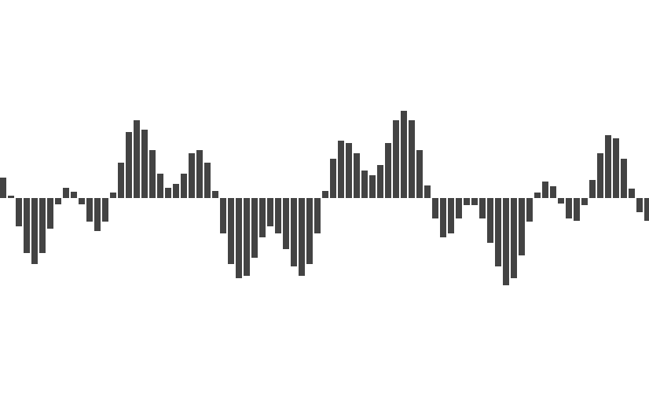

印象中使用的第一个 PC 音乐播放器是「千千静听」，大概是 08 年左右。我还清楚地记得它自带了一首梁静茹的歌「Love is everything」，动听的旋律至今萦绕耳旁。


千千静听的左上角有一组随着音乐跳动的柱子，我想大家都习以为常了，很多播放器都有这功能。但是其实有没有想过，这是怎么实现的？

要理解这个问题，我们首先要理解声音是什么。

<!--more-->

## 波

中学物理有介绍过，声音是由物体振动产生的，这个振动经由介质传导到我们的耳朵中引起耳膜振动从而让我们听见声音。

我们可以用波形来描述振动，其中横轴是时间，纵轴是振动的位移，也就是离开原点的距离。

振动的两个关键属性是频率和振幅，频率是指一秒钟振动多少次，对应于音高，频率越高声音越尖锐刺耳。

振幅则表示最大的位移值，对应于音量，振幅越大声音越响。


上图是用 [matplot](https://matplotlib.org/) 绘制的一个正弦波，可以看出在 0.01s 内振动了 2 次，因此频率是 200，振幅是 1。

```python
from matplotlib import pyplot as plt
import numpy as np

def sin_wave(hz):
  x = np.linspace(0, 0.01, 1000, endpoint=False)
  y = np.sin(x * hz * 2 * np.pi)
  plt.plot(x, y)
  plt.xlabel("Time")
  plt.axhline(y=0, color='k')
  plt.show()

sin_wave(200)
```

这种最简单的波形对应的声音叫做 pure tone，顾名思义，非常的简单而且纯粹。

下面是用 [scipy](https://www.scipy.org/) 生成的 200hz 的声音，大家可以听听看。

<audio controls>
  <source src="200hz.wav" type="audio/wav">
</audio>

```python
import scipy.io.wavfile as wav

SAMPLE_RATE = 44100
DURATION = 5

def write_wav(hz):
  x = np.linspace(0, DURATION, SAMPLE_RATE * DURATION, endpoint=False)
  tone = np.sin(x * hz * 2 * np.pi)
  normalized_tone = np.int16((tone / tone.max()) * 32767)
  wav.write(f"{hz}hz.wav", SAMPLE_RATE, normalized_tone)

write_wav(200)
```

这是 800hz 的声音，可以明显感觉到，声音更加尖锐了。

<audio controls>
  <source src="800hz.wav" type="audio/wav">
</audio>

现实世界中我们听到的声音不会是 pure tone，而是各种 pure tone 叠加的结果。

下图中蓝色是 200hz，黄色是 800hz，而绿色则是它们叠加的结果，已经不再是一个 pure tone 了。


下面是绿色曲线听起来的效果。

<audio controls>
  <source src="mixed.wav" type="audio/wav">
</audio>

总结一下：

- 我们可以用一个波形图来表示声音，其中 X 轴是时间，Y 轴是振动的位移
- 最简单的正弦波对应的声音叫做 pure tone
- 日常中我们听到的声音都是各种 pure tone 叠加的结果

{}

如果想了解一点乐理，[LIGHTNOTE](https://www.lightnote.co/music-theory/sound-waves) 非常不错。

它的网页做得很棒，通过互动的形式讲述基本的乐理知识，包括音阶、和弦，十二平均律等。

{}

## 采样

因为声音是一个随时间变化的连续函数，任意一段间隔内都有无穷多个值，而无穷多的数据是没办法存储在计算机中的。

想要存储，我们就需要将它离散化变成离散序列，具体的方法就是采样，使用固定的间隔对函数进行求值。

这是原始的声音。


这是采样后的结果。



通过采样，我们将一个无尽序列变成了一个有限序列，其中每一个值叫做样本，这样就可以方便地在计算机中存储了。

采样的关键参数有两个，分别是采样频率和采样深度。

采样频率是指每秒钟采样多少次，很明显，采样频率越高，样本越多，数据量越大，同时也更接近原始的声音。

采样深度是指用多少比特去存储采样得到的值，使用的比特越多，还原得到的声音越细腻，和图片的色彩深度是一个道理。

假设我们用 16bit 采样深度和 44100 的采样频率，那么一段一秒钟的声音就变成了一个 44100 大小的 int16 数组。

得到采样值数组以后，接下来如何存储这个数组就是编码的范畴了。我们可以直接存，也可以采用某种算法压缩以后再存。各种各样的办法，对应着各种各样的音频格式，比如 MP3, AAC, WAV 等。

这其中 AAC 和 MP3 格式是有损的，也就是存储以后再读出来，得到的样本和原始的会有一些区别，但这些区别很细微，可以忽略。有损的特点就是在基本不影响最终播放效果的情况下，大幅度减少文件体积。

而 WAV 则是无损的，输入是什么，读出来就是什么，缺点自然是体积要大很多。

我们可以通过 scipy 来读取 WAV 音频。

```python
import scipy.io.wavfile as wav

rate, all_samples = wav.read("xxx.wav")

print(rate, len(all_samples), all_samples.dtype)
# 44100 10639873 int16
# 上面分别是：采样率，样本总数，以及样本值的类型
# int16 说明每一个样本是 16bit 整数

print(all_samples[:20])
# [-41 -51 -49 -41 -28 -15 -20 -33 -32 -38 -54 -54 -44 -30  -8  10  11   2
# -14 -36]
# 可以看到样本就是一组数字
```

可以看出，采样频率是 44100，一共有 10639873 个样本，使用 int16 进行存储，计算可知这首歌的时间是 241 秒。

## 傅里叶变换

给定一个 200hz 的波形和一个 800hz 的波形，计算它们叠加以后的结果非常简单，没有任何难度。


但是，如果给到叠加以后的结果呢？


能看出上面的绿色曲线是 200hz+800hz 叠加得到的吗？完全看不出来，甚至，这样的逆推真的可行吗？还是说和永动机一样在原理上就是不可行的？

答案是可行的，通过傅里叶变换，我们可以将一个复合波形拆解为构成它的简单波形。

想想都觉得不可思议，这是怎么做到的？傅里叶又是怎么想到的？不得不说十八世纪的法国数学家傅里叶是一个天才，让人仰望。

{}

3Blue1Brown 有一个视频介绍傅里叶变换的原理，非常棒：[形象的介绍：什么是傅里叶变换？](https://www.youtube.com/watch?v=spUNpyF58BY)

{}

接下来我们来看看怎样通过傅里叶变换来拆解复合波形。

我们可以认为傅里叶变换是一个函数，它的输入为 N 个实数，代表采样值，输出为 N 个复数，代表不同频率的分量，这里我们忽略复数的实部和虚部，只关心它的模，也就是绝对值。

{}

这里关于傅里叶变换的说法并不完整，比如傅里叶变换的输入也可以是复数。但是对我们来说理解到这一层面就够了。如果想要深入研究，可以去学习数字信号处理相关的课程。

{}

我们使用 scipy 来实际进行一下傅里叶变换。

```python
from scipy.fft import fft, fftfreq

# 这是即将进行变换的采样值: [0, 1, 2, 3, 4, 5, 6, 7]
samples = np.arange(8)

# 这是傅里叶变换的结果
y = fft(samples)

for i in y:
  print(i)

# 变换结果为 8 个复数
# (28-0j)
# (-3.9999999999999996+9.65685424949238j)
# (-4+4j)
# (-4+1.6568542494923797j)
# (-4-0j)
# (-4-1.6568542494923797j)
# (-4-4j)
# (-3.9999999999999996-9.65685424949238j)

# x 是上面每个结果对应的频率
# 这里 fftfreq 函数的第一个参数为样本数量
# 第二个参数为 采样率的 倒数，我们假定采样率为 8
x = fftfreq(len(samples), 1 / 8)

print(x)
# [ 0.  1.  2.  3. -4. -3. -2. -1.]
# 这里意味着 y[0] 对应的频率是 0，y[1] 对应的频率是 1
# 负数频率是什么含义？我们可以不管，忽略
```

上面的代码我们构造了 8 个数字进行傅里叶变换，并假定这组样本是使用采样率 8 进行采样得到的。

变换的结果是 8 个复数，这 8 个复数对应 8 个频率，我们可以看出，正频率和负频率对应的变换结果是一样的，也就是变换后的结果是对称的。

上面得到的结果意义不大，因为输入没什么意义。现在我们使用傅里叶变换处理一下 200hz+800hz 叠加后的波形，看看是否能还原回 200hz 和 800hz。

```python
import numpy as np
from matplotlib import pyplot as plt
from matplotlib.pyplot import figure
from scipy.fft import fft, fftfreq

figure(figsize=(14, 6), dpi=80)

DURATION = 0.01
SAMPLE_RATE = 44100

def gen_sine_wave(freq):
  x = np.linspace(0, DURATION, int(DURATION * SAMPLE_RATE), endpoint=False)
  y = np.sin(x * freq * 2 * np.pi)
  return y

hz200 = gen_sine_wave(200)
hz800 = gen_sine_wave(800)

# 叠加后的采样数据
# 这里每个样本不是 int16，而是 float，无关紧要
total = hz200 + hz800

y = fft(total)
x = fftfreq(len(total), 1 / SAMPLE_RATE)

# 此时横轴是频率，纵轴是该频率的分量
# 使用 np.abs 计算复数的模
plt.plot(x, np.abs(y))
plt.show()
```

图中我们可以看出，首先输出结果是左右对称的，我们忽略掉负频率部分，只关注正频率。

其次，傅里叶变换告诉我们该输入信号由 2 个频率组成，程序运行时鼠标放上去可以看出是 200 和 800。也就是说，通过傅里叶变换，我们将复合波形拆解为了简单波形。

或者说，通过傅里叶变换，我们将一个信号拆解为了一组不同频率的正弦波，将它从时域变换到了频域。信号还是这个信号，只不过换个角度去看它。


总结一下：

- 傅里叶变换是一个函数，输入一串数字代表样本值，输出一串复数代表频率分量
- 每个数字具体代表的频率可以根据样本数量和采样频率计算得知
- 我们不关心复数的方向，我们只关心复数的模
- 傅里叶输出的结果是左右对称的，因此只有一半的信息有价值

因为输出结果是对称的，只有一半的信息有价值，因此有一个变体叫做 `rfft`，只返回一半的信息，计算速度可以更快一些。

```python
import numpy as np
from scipy.fft import rfft, rfftfreq

SAMPLE_RATE = 8

samples = np.arange(8)

# 此时 x 和 y 都是 5 个值
y = rfft(samples)
x = rfftfreq(len(samples), 1 / SAMPLE_RATE)

# y[0] 表示频率 0 的分量
# y[1] 表示频率 1 的分量
print(x)
# [0. 1. 2. 3. 4.]

for i in y:
  print(i)

# 和之前 fft/fftfreq 的输出对比，可以发现结果是一样的，只不过去掉了对称的冗余信息
# (28+0j)
# (-3.9999999999999996+9.65685424949238j)
# (-4+4j)
# (-4+1.6568542494923797j)
# (-4+0j)
```

## 音频可视化

到了这里所有实现音频可视化所需要的知识都备齐了。

首先我们可以猜到，随音乐跳动的每个柱子，对应的是一个频率或一组频率，而柱子的高度则是频率的分量大小，这两个信息傅里叶变换都能给到。

现在剩下的问题则是输入是什么？我们不可能把一首歌曲的所有样本作为输入进行傅里叶变换，如果这样做，我们只能得到一份频率数据。

我们希望得到的频率数据随着音乐在变化，因此这里要选择一个窗口大小（FFT_SIZE），比如 2048。随着音乐的播放，我们每次都从当前播放位置选择 2048 个样本然后进行傅里叶变换。

现在我们的初步音频可视化方案就确定了：

- 解析音频文件得到 allSamples
- 每次绘图时，从当前 sample 开始选择 FFT_SIZE 个 sample
- 对这些 sample 进行傅里叶变换
- 对变换得到的复数求模
- 把结果变换到 0 ~ 1 然后绘图

接下来我们用 Web 来实现一个简单的音频可视化工具。

首先，解析音频文件得到 allSamples 我们可以使用 WebAudio 的 API。

```js
// 得到某个音频文件的二进制数据
const ab = fetch("xxx.mp3").then(res => res.arrayBuffer())

// 新建 WebAudio context
const audioCtx = new AudioContext()

// 解析 arrayBuffer
const audioBuffer = audioCtx.decodeAudioData(ab)

console.log(audioBuffer)
// AudioBuffer {length: 10639872, duration: 241.2669387755102, sampleRate: 44100, numberOfChannels: 2}
//  duration: 241.2669387755102
//  length: 10639872
//  numberOfChannels: 2
//  sampleRate: 44100
// [[Prototype]]: AudioBuffer

// 一般来说音频都有多个声道，用于立体声播放
// 这里我们选第一个声道就可以了
const allSamples = audioBuffer.getChannelData(0)

// allSamples 就是我们要的样本数组，每一个样本值是浮点数
console.log(allSamples.slice(0, 10))
// Float32Array(10) [0, 0, 0, 0, 0, 0, 0, 0, 0, 0]
```

接下来，我们使用 `requestAnimationFrame` 来进行绘制。

每次绘制的时候，需要先获取当前的播放位置。audioBuffer 中有音频的总时间，通过 `audioCtx.currentTime` 我们可以得知当前的播放时间，两个相除便是播放位置。

```js
// 用户点击播放时
const onPlay = () => {
  // 记录下播放的开始时间
  const startTime = audioCtx.currentTime

  const draw = () => {
    requestAnimationFrame(draw)

    // 目前播放了多少时间 (seconds)
    const cur = audioCtx.currentTime - startTime

    // 播放的进度是多少
    const per = cur / audioBuffer.duration

    const startIndex = Math.floor(allSamples.length * per)

    // 从 startIndex 开始切割 FFT_SIZE 个 sample 出来
    // 此时要进行傅里叶变换的 samples 就准备好了
    const samples = allSamples.slice(startIndex, startIndex + FFT_SIZE)
  }

  requestAnimationFrame(draw)
}
```

接下来就是傅里叶变换了，这里我找了一下，JS 相关的库很少，不过验证下来 [fft.js](https://github.com/indutny/fft.js/) 是可用的。

{}
不得不说科学计算还是 Python 方便，numpy 和 scipy 真的太好用了。
{}

经过 FFT 以后，我们得到了 1025 个复数，对这些复数取模，得到 1025 个实数。

```js
// JS 没有复数，我们自行定义一个
class Complex {
  constructor(real, imag) {
    this.real = real
    this.imag = imag
  }

  abs() {
    return Math.sqrt(this.real * this.real + this.imag * this.imag)
  }
}

const rfft = (samples) => {
  const f = new FFTJS(samples.length)
  const out = f.createComplexArray()

  const N = samples.length / 2 + 1

  f.realTransform(out, samples)

  const value = []

  for(let i = 0; i < N; i++) {
    value[i] = new Complex(out[2*i+0], out[2*i+1])
  }

  return value
}

// 此时我们得到了一组实数
const y = rfft(samples).map(c => c.abs())
```

{}
其实这里还有一个过程，我们不会直接把 samples 进行 FFT 变换，而是会先应用一个 Window Function，这样做的目的如果感兴趣可以自行了解。

对于我们来说，Window Function 就是一个 `number[] -> number[]` 的函数。
{}

接下来就是将这些数字变换到 0 ~ 1 区间，这一步比较简单，观察一下最大最小值做个线性变换就行了。

```js
const result = y.map(v => (v + 20) / 80)
```

有了一组 0 ~ 1 的数字以后，我们就可以使用 Canvas 进行绘图了。

```js
const W = 800 // canvas width
const H = 600 // canvas height

const draw = (spectrum) => {
  ctx.clearRect(0, 0, W, H)

  const barWidth = W / spectrum.length

  for(let i = 0; i < spectrum.length; i++) {
    const v = spectrum[i]
    const x = i * barWidth
    const height = v * H
    const y = H - height
    ctx.fillRect(x, y, barWidth, height)
  }
}
```

然后我们来看看结果，打开 [audio-vis-demo][demo]，选择一个音频文件，取消勾选 "Smooth"，点击播放，然后我们会发现，柱子可以正常地绘制出来，但是它们”跳跃“得非常厉害，不够平稳。

这是因为我们漏了一步，叫做 Time smoothing。

具体的机理我并不理解，所以就不再说明了，对我们的目标来说，这部分当做黑盒处理就可以了。

这里我想说明一下，在我看来，学习任何知识都是分层的，学到自己感兴趣的层级即可，对下一层有一个定性的认识，需要的时候可以再去细究。

我们可以认为 Time smoothing 就是对当前的 result 和上一个 result 进行某种操作，然后输出一组值。

下面是具体的算法，代码非常简单，但是效果非常明显。

```js
const smoothConstantDown = 0.08
const smoothConstantUp = 0.8

if(lastY != null) {
  for(let i = 0; i < lastY.length; i++) {
    if(y[i] < lastY[i]) {
      lastY[i] = y[i] * smoothConstantDown + lastY[i] * (1 - smoothConstantDown)
    } else {
      lastY[i] = y[i] * smoothConstantUp + lastY[i] * (1 - smoothConstantUp)
    }
  }
} else {
  lastY = y
}
```

我们在 Demo 中勾选上 "Smooth" 启用这个算法，然后就会发现图像马上变得不再跳动了，整体结果已经和其他播放器很接近了。

注意，这里我们是为了学习底层的步骤和细节，所以很多操作都自己来做。如果真的需要开发相关功能，使用 WebAudio 的 API 是更合理的选择。

我在 [audio-vis-demo][demo] 中也基于 WebAudio 的 API 进行了实现，主要是为了对比和参考。

到这里，我们完整地实现了从一组数字到可视化图形的全过程，深切地感受到了数学的魅力。这里的编码一点也不难，难的，或者是让人赞叹的，是背后的数学，人类智慧皇冠上最灿烂的明珠。

[demo]: http://cjting.me/audio-vis-demo/
